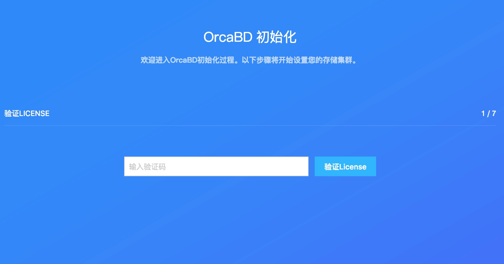
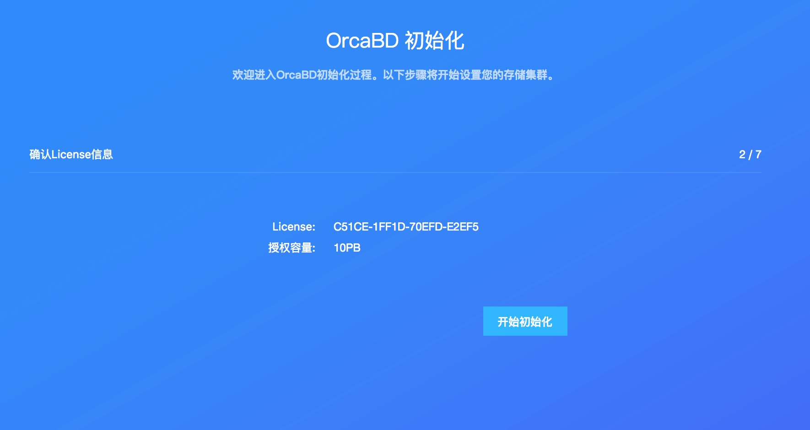
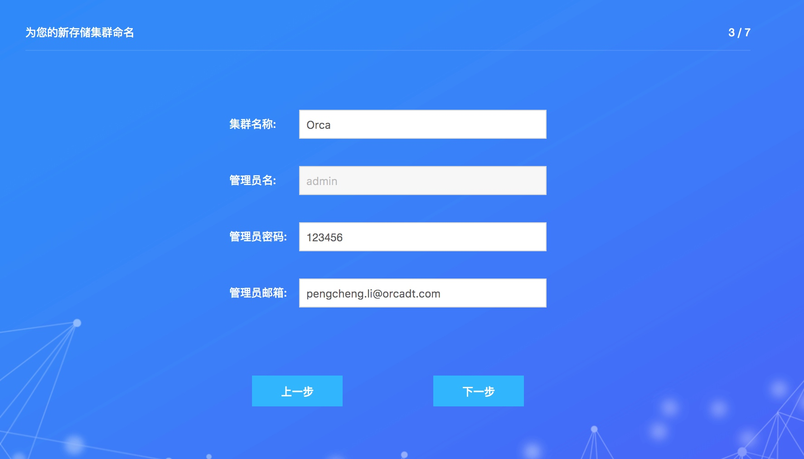
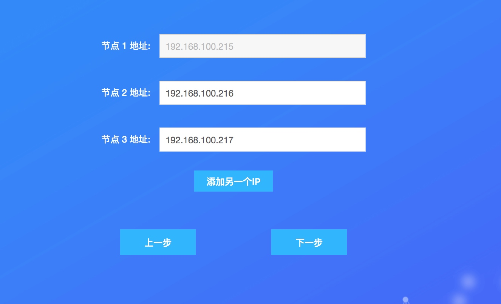
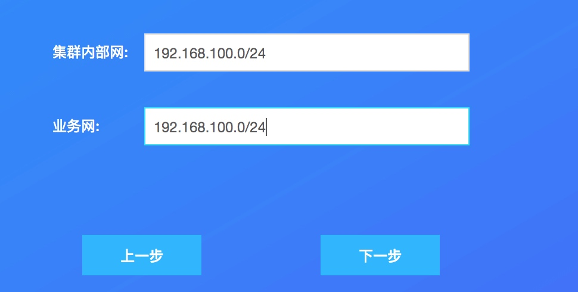
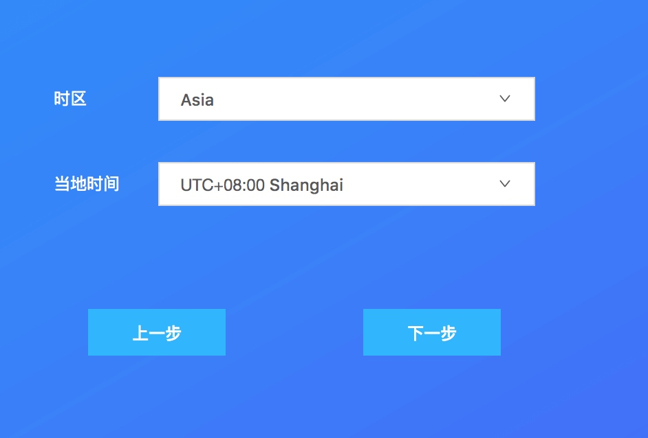
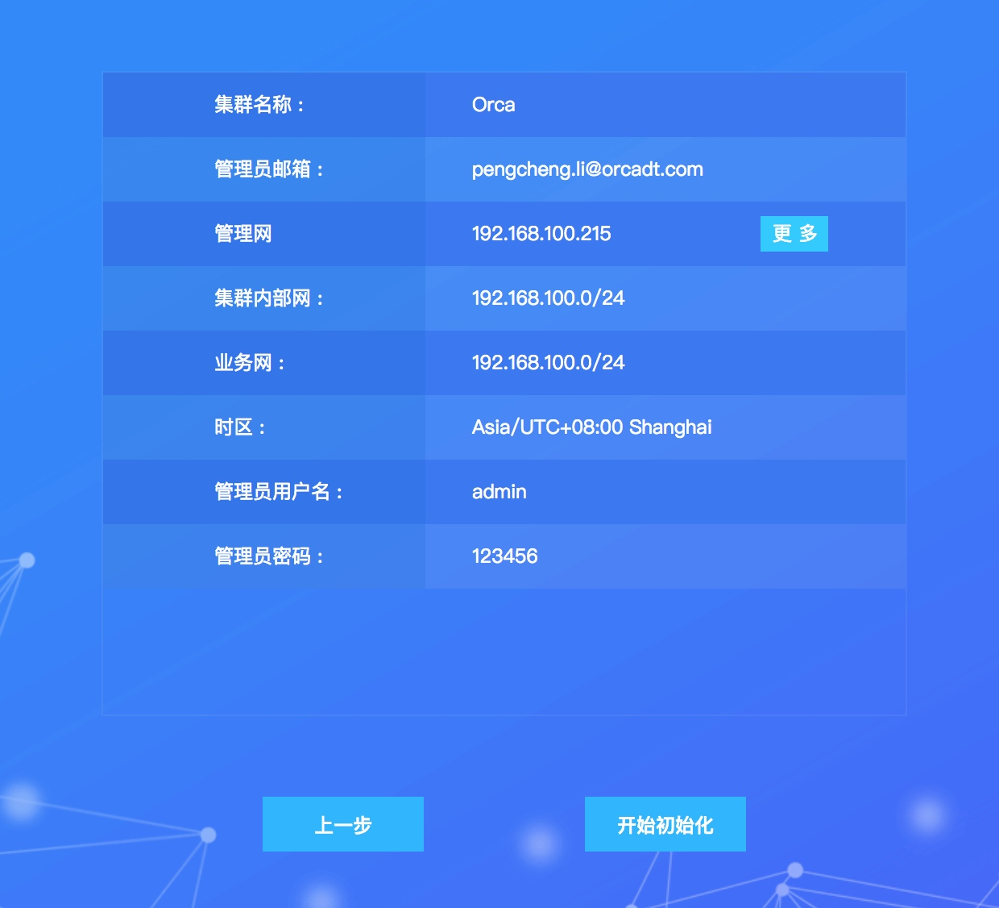

# 初始化流程
初始化的步骤
## 1 输入 LICENSE

验证结束后


## 2 为集群命名


## 3 储存节点 ip

## 4 配置网络

## 5 设置时区

## 6 检查并核对信息

## 开始初始化
开始初始化后的步骤就是和前端没有关系了,接下来的步骤就是后端的操作
### 1 build ansible cluster

```
    /**
     *
     * @param ipList {Array}
     * eg. ['192.168.28.1','192.168.28.2','192.168.28.3']
     */
    async buildAnsibleCluster(ipList) {
        const buildAnsible = systemUtil.getProjectPath()  + 'shell/initializeCluster.yml';
        let param = JSON.stringify({memberIPAddrs: ipList});
        const cmd = `sudo -u denali ansible-playbook ${buildAnsible} -e '${param}'`;
        await systemUtil.promiseExec(cmd);
    }
```
用输入的节点建立 ansible 集群 最主要的命令就是这一句 `sudo -u denali ansible-playbook /var/denali-mw/ -e memberIPAddrs:['192.168.28.1','192.168.28.2','192.168.28.3']`
### 2 设置时区

```
    async setTimeZone(region, location) {
        let city = location.replace(/\S+\s/, '');
        let command = `sudo ln -sf /usr/share/zoneinfo/${region}/${city} /etc/localtime`;
        await ansibleUtil.executeClusterCommand(command);
    }
```
主要的命令是 `sudo ln -sf /usr/share/zoneinfo/${region}/${city} /etc/localtime` 这个命令用第一步创建好的 ansible 去执行
### 3 build thunderbd cluster 初始化集群
初始化集群
* [ ] create default confirguration

```
 _createDefaultConfig(clusterNetwork, publicNetwork){
        let command = `sudo ${CephPath}ceph_make_conf.sh -c ${clusterNetwork} -p ${publicNetwork}`;
        return ansibleUtil.executeClusterCommand(command);
    },
```
主要的命令 `sudo /usr/share/denali-ceph/ceph_make_conf.sh -c ${clusterNetwork} -p ${publicNetwork}`这里的 clusterNetwork 和 publicNetwork 的值是在前面的配置网络中输入的值
* [ ]  select monitor node 选择主节点
通过对 hostname 的判断看是否全部机器是 tahoe 或者是虚拟机然后做相应的处理,在这里没有向底层发送命令.
* [ ] create monitor on select node,在 ansible 里执行命令 
```
let command = `sudo ${CephPath}ceph_create_monitor_local.sh ${monitorIpIndex > 0 ? '-a' : ('-c ' + (tahoeCount > 1 ? 2 : 1))}`;
            return ansibleUtil.executeAnsibleCommand(hostname, command);
   命令是 sudo /usr/share/denali-ceph/ceph_create_monitor_local.sh ${monitorIpIndex > 0 ? '-a' : ('-c ' + 1)} 
```
* [ ]  create osd on all node 在这里就是在每个节点上去创建 osd ,涉及到底层的命令是 `sudo /usr/share/denali-ceph/denali-cephceph_create_osds_local.sh -t chassis -n 1 -f`   
* [ ]  start hotplug 发送给底层的命令是 `sudo /usr/share/denali-ceph/ceph_start_hotplug.sh`
* [ ]  config Acl  发送给底层的命令是 `sudo /usr/share/denali-ceph/thunderbd_target_interface/thunderbd_set_global_attribute_for_target.sh auto_add_mapped_luns=false`

### 4 build Mongo Cluster  
第四步就是新建一个 mongodb 的集群,不涉及到底层,只是在 UI 后端进行配置
### 5 保存初始化信息
在第四步新建好 mongodb 集群后把初始化的信息保存下来
### 6 重启 uiagentd 
### 7 重启 uiserver mongodb